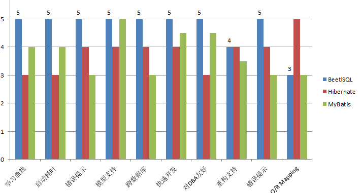

# Beetlsql

* 作者: 闲大赋,Gavin.King,Sue,Zhoupan，woate,darren
* 开发时间:2015-07
* 网站 http://ibeetl.com
* qq群 219324263
* 当前版本 2.10.2 (280K), 另外还需要beetl 包
* 文档地址: http://ibeetl.com/ 

# beetlsql 特点

* 派别:SQL为中心
  * 强化SQL管理，通过md文件管理sql，使用Beetl模板编写复杂sql

  * 简单SQL可以通过Query类链式API完成
   * 内置常见增删改查功能，节省项目50%工作量
* 全面支持跨数据库平台
* 支持一对一，一对多等常见的ORM映射
* 其他
   * 具备代码生成功能
   * 主从支持
   * 支持Interceptor，如Debug，Cache等

BeetSql是一个全功能DAO工具， 同时具有Hibernate 优点 & Mybatis优点功能，适用于承认以SQL为中心，同时又需求工具能自动能生成大量常用的SQL的应用

# 内置增删改查
* void insert(T entity);
* int updateById(T entity);
* int updateTemplateById(T entity);
* int deleteById(Object key);
* T unique(Object key);
* T single(Object key);
* T lock(Object key);
* List<T> all(); 
* List<T> template(T entity);
* <T> T templateOne(T entity); 
* List<T> execute(String sql,Object... args);
* ....等等大量内置方法且可以扩展内置方法

# Query查询

~~~java

List<User> list = userDao.createQuery().andEq("name","hi").orderBy("create_date").select();
~~~
如果是Java8,则可以
~~~java
List<User> list1  = userDao.createLambdaQuery().andEq(User::getName, "hi").orderBy(User::getCreateDate).select();
~~~
Query接口分为俩类：

一部分是触发查询和更新操作，api分别是

* select 触发查询，返回指定的对象列表
* single 触发查询，返回一个对象，如果没有，返回null
* count 对查询结果集求总数
* delete 删除符合条件的结果集
* update 更新选中的结果集

另外一部分是各种条件：

| 方法                       | 等价sql                  |
| ------------------------ | ---------------------- |
| andEq,andNotEq           | ==,!=                  |
| andGreat,andGreatEq      | >,>=                   |
| andLess,andLessEq        | <,<=                   |
| andLike,andNotLike       | LIKE,NOT LIKE          |
| andIsNull,andIsNotNull   | IS NULL,IS NOT NULL    |
| andIn ,andNotIn          | IN (...) , NOT IN(...) |
| andBetween,andNotBetween | BETWEEN ,NOT BETWEEN   |
| and                      | and ( .....)           |
| or系列方法                   | 同and方法                 |
| limit                    | 限制结果结范围，依赖于不同数据库翻页     |
| orderBY                  | ORDER BY               |
| groupBy                  | GROUP BY               |

# 管理SQL

~~~java
@SqlResource("console.user")
public interface UserConsoleDao extends BaseMapper<SysUser> {

    void batchDelUserByIds(List<Long> ids);

    void batchUpdateUserState( List<Long> ids,  GeneralStateEnum stateEnum);
    
    @Sql("update sys_user set password=? where id=?")
    int changePassword(String newPassword,long id);

}
~~~

对应的sql文件是console/user.md,内容如下
~~~markdown
batchDelUserByIds
===
    update SYS_USER u set u.del_flag = 1 where u.id in( #join(ids)#)
    
batchUpdateUserState
===
    update SYS_USER u set u.state = #state# where u.id in( #join(ids)#)
~~~

# 关系映射

~~~markdown
selectUserAndDepartment
===
    select * from user where user_id=#userId#
    @ orm.single({"departmentId":"id"},"Department");
    @ orm.many({"id":"userId"},"user.selectRole","Role");

user.selectRole
===

    select r.* from user_role ur left join role r on ur.role_id=r.id

    where ur.user_id=#userId#

~~~
也支持注解说明映射关系

* 与hiberante，myabtis比较

说明博客：https://my.oschina.net/xiandafu/blog/617542

# 开发人员帅照

