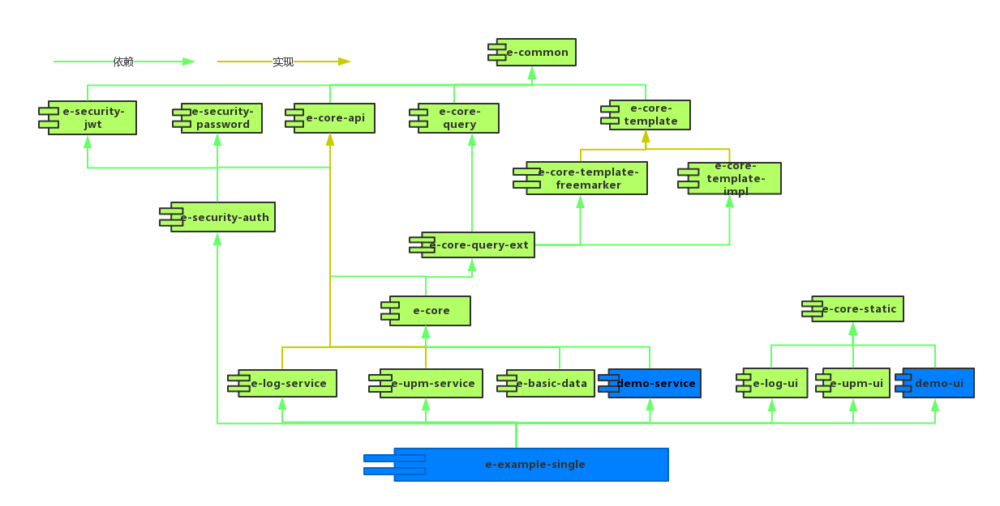
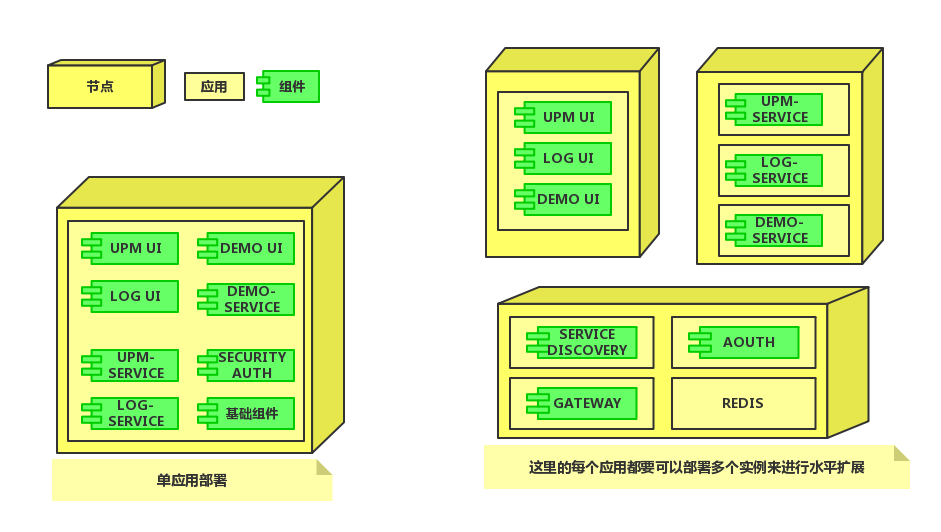
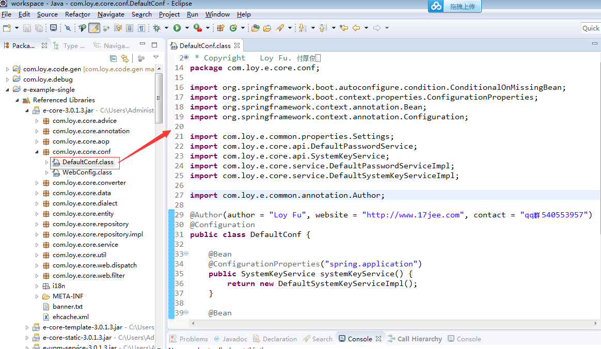


# 项目演示地址
http://www.17jee.com     QQ交流群:   204690448  540553957(已满)
# 目的
E框架的目的是让开发不必从零开始开发，让开发者只关注自己的业务功能。
# 技术说明
* 框架采用微服务的设计思想，而且各工程易分易合
* 此框架采用前后台分开，前后台都可以单独部署，前端采用轻量级的扁平化设计（html+javascript+Bootstrap）, 会自动针对不同的屏幕尺寸调整页面，使其在各个尺寸的屏幕上表现良好。 
* 后端采用Spring boot 、 Spring Cloud，不需要部署WAR 文件，可直接运行jar文件。
* 系统权限框架采用spring-security oauth2，实现前后台权限校验，权限实现了用户授权和客户端授权。
* 持久层采用JPA ，能够很好的适应不同数据库，并实现注解式动态查询功能。
* 数据响应该采用json格式。
* 服务采用REST形式，能够方便的与手机app进行对接，集成swagger能够在线查看RESTAPI 文档和在线测试服务接口
* 支持单点登录，可以多系统进行菜单集成，形成一个portal。
* 支持高并发和水平扩展，支持Session的统一存储。
* 项目采用gradle构建，能够方便的将各项目进行按需组装。

## 构建须知
* 设好jdk环境变量，项目需要jdk8,项目编码和数据库编码都采用UTF-8
* 输出日志在eclipse下有乱码可以通过设置项目下的logback.groovy文件中日志编码为UTF-8来解决
* 项目默认用到8080端口，请检查8080端口是否被占用
* 为了演示方便默认数据库设为了H2数据库，演示时不用做数据库相关的任何设置，按照构建说明进行就可以了
* 系统默认用户名密码分别为 admin    123456
* 实际可设为mysql，修改resources\application.yml文件的数据库相关设置为实际值,建库建表数据初始化都会自动进行
* 详细构建可看QQ群中的构建视频(E构建)

##### 单体服务构建

* 运行start-single-service.bat 文件，这里需要等待下载相关jar包
* 构建成功后在浏览器中输入http://localhost:8080  进入页面

##### 微服务构建

* 在e目录下运行gradlew build ，成功后进行下一步
* 在e目录下运行start-micro-service,也可以运行start-micro-service-w(启动Swing界面，可方便查看各项目日志)；
* 此运行方式只作演示与快速启动，实际部署、启动根据自己需求作相应调整
* 运行成功后在浏览器中输入http://localhost:8080  进入页面

# 开发环境

## eclipse
 
* 直接在e目录下运行gradlew  eclipse 生成eclipse项目；导入e目录；运行e-example-single项目下的SingleApplicationMain文件；进入http://localhost:8080；
* 多系统启动可按下面顺序来启动各项目，最好等前一个项目启动完后再启动下一下项目

	- e-example-ms-db
    - e-example-ms-discovery
    - e-example-ms-upm
    - e-example-ms-oauth2
    - e-example-ms-log
	- e-example-ms-demo
    - e-example-ms-ui
    - e-example-ms-gateway

## idea

* 直接在e目录下运行gradlew  eclipse 生成eclipse项目；导入e目录；运行SingleApplicationMain文件；进入http://localhost:8080；

# 开发说明

* 一般情况每个具体的子项目由两工程组成，一个是UI，一个是Service 目录结构如
* 	demo
*    |_   demo-ui
*    |_   demo-service
*  
* 可以象例子中那样根据需要把子工程组装起来
* 开发时尽量在自己的代码中扩展功能和替换原来的功能，而不是修改框架代码本身，以便于今后升级方便

# 框架结构

# 部署示例

# 关于源码
框架本身源码是以jar的形式提供，在生成eclipse项目时会自动从maven库上下载，可以在开发工具中查看源码和debug。也可以在http://search.maven.org 上搜索com.17jee来查询框架代码

# 关于修改主页信息（以e-example-single工程为例）

*  1.只修改主页上的文字：可以在e-example-single工程src/main/resources下新建 i18n  包，将e-core-3.0.1.5.jar 下面  i18n 下的 .properties文件拷贝到新建的i18n下去做修改。
*  2.修改主页文件：可以在e-example-single工程src/main/resources下新建 static 文件夹，将e-core-static-3.0.1.5.jar 下面  public 下的 home_tabs.html文件拷贝到新建的static下进行修改。
*  3.修改主页文件：可以通过修改e-example-single工程下的配置文件application.yml  的e.conf.homePage来指定自己主页；
